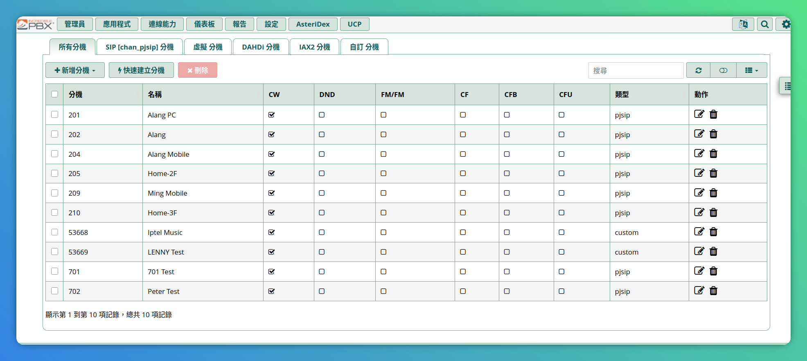
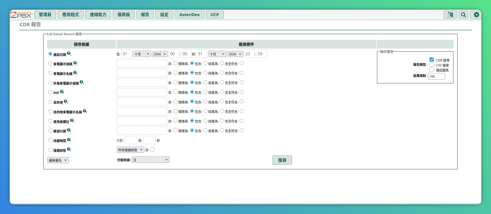
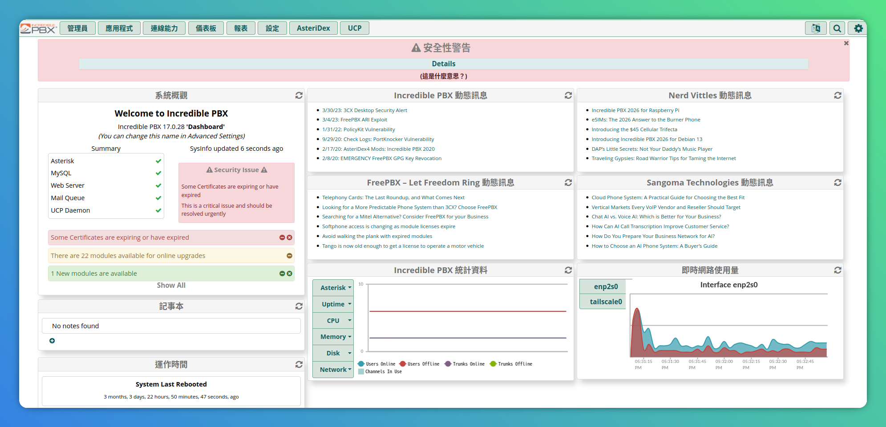
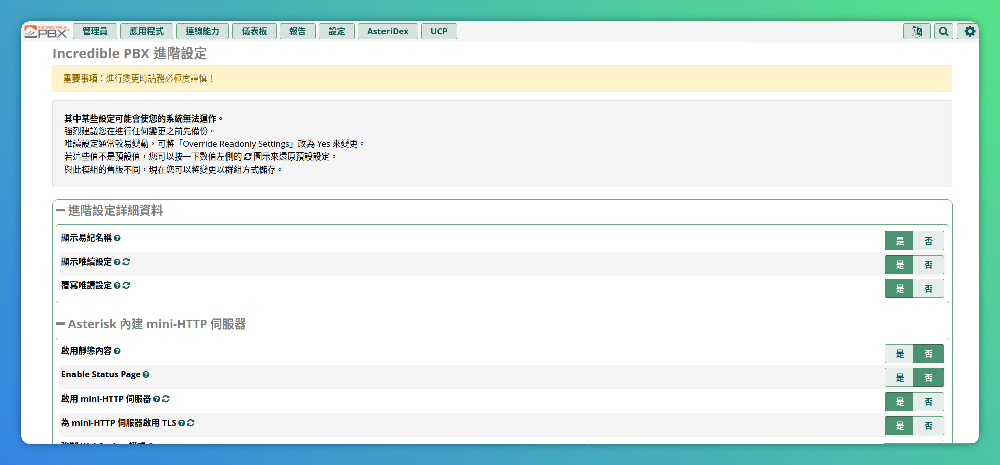

# FreePBX 正體中文語系檔

FreePBX 各模組管理介面的正體中文 gettext 語系檔。將對應模組的 `.po` 編譯為 `.mo` 放入 FreePBX 主機，即可讓 Web UI 以正體中文顯示。

本專案涵蓋 **78 個模組** 的翻譯（`amp` 核心 + 77 個擴充模組），每模組各自獨立一份 `.po`。套用機制與流程對所有模組通用；亦提供 `deploy.sh` 一鍵自動化部署。

## 語系檔說明

| 項目 | 內容 |
|---|---|
| 交付物 | `po/<模組>.po`（每模組一份，共 78 模組） |
| 語系 | `zh_TW`（正體中文，UTF-8） |
| 覆蓋範圍 | `amp`（framework 核心，2911 條 msgid）+ 77 個擴充模組 |
| 對齊版本 | `amp` 對齊 [`FreePBX/framework`](https://github.com/FreePBX/framework) `release/17.0`；各模組 pot 依其上游版本 |
| 來源 POT | `pot/<模組>.pot`（純英文模板，無既有譯文） |
| 翻譯者 | Alang Hsu `<alang.hsu@gmail.com>` |
| 品質 | `msgfmt` 驗證通過（無 c-format 錯誤）、佔位符與 HTML 格式規則依 `AGENTS.md` |
| 自動化部署 | `deploy.sh`（編譯 + 部署 + 清理一鍵完成） |

- **amp**＝framework 核心（管理介面共用字串），上游為 `FreePBX/framework` 的 `amp_conf/htdocs/admin/i18n/amp.pot`。
- 其他模組各自成檔，上游 pot 位於各模組 repo 的 `i18n/<模組>.pot`。

## 介面畫面

### 分機



### CDR 報告



### 儀表板



### 進階設定



## 套用機制

FreePBX 管理介面使用 PHP gettext：

- 語系由 `View.class.php` 的 `setLanguage()` 統一決定：`bindtextdomain(<domain>, <路徑>)`、`bind_textdomain_codeset(<domain>, 'utf8')`、`textdomain(<domain>)`。
- 語系來源優先序：登入使用者設定（Userman）→ 瀏覽器 cookie `lang` → 全域設定 `UIDEFAULTLANG`（Advanced Settings 的 **Default language**，預設 `en_US`）。**所有模組共用同一語系決定**。
- `setLanguage()` 會以 `locale -a` 驗證語系是否存在，**不存在則靜默退回 `en_US`**。
- 執行期載入路徑（gettext 只讀 `.mo`，`.po` 僅供維護）：
  - **amp**（framework 核心，domain 亦為 `amp`）：`admin/i18n/<語系>/LC_MESSAGES/amp.mo`
  - **其他模組 `<模組>`**：`admin/modules/<模組>/i18n/<語系>/LC_MESSAGES/<模組>.mo`；若該模組沒有 i18n 目錄，會 fallback 使用 amp 的譯文（`modgettext.class.php`）

## 套用步驟（在 FreePBX 主機上執行）

### 前置檢查（一次即可，影響所有模組）

```bash
locale -a | grep zh_TW     # 需含 zh_TW.utf8；缺則先執行 locale-gen zh_TW.UTF-8
php -m | grep gettext      # 需有 gettext 擴充（FreePBX 發行版內建）
```

### 啟用 zh_TW 語系（若系統尚未支援）

若 `locale -a | grep zh_TW` 無輸出，表示系統尚未建立 `zh_TW.utf8` locale，需先產生：

```bash
# Debian / Ubuntu
sudo locale-gen zh_TW.UTF-8

# 若 locale-gen 不可用（或無效），改用 localedef
sudo localedef -i zh_TW -f UTF-8 zh_TW.utf8

# 驗證
locale -a | grep zh_TW     # 需看到 zh_TW.utf8
```

> FreePBX 以 `locale -a` 驗證語系是否存在，**不存在則靜默退回 `en_US`**。部署語系檔前务必確認此步驟完成。

### 自動化部署（建議）

Clone 專案

```bash
git clone https://github.com/a-lang/freepbx-i18n-zhtw
cd freepbx-i18n-zhtw
```


`deploy.sh` 會自動完成所有模組的編譯、部署與清理：

1. 修改 `deploy.sh` 中的 `web_root` 為 FreePBX 的 Web root（可查 `/etc/amportal.conf` 的 `AMPWEBROOT`，通常為 `/var/www/html`）
2. 執行腳本：

```bash
sudo bash deploy.sh
```

腳本自動處理：
- 編譯所有 `po/*.po` 為 `.mo`
- `amp` 部署至 `admin/i18n/zh_TW/LC_MESSAGES/`，其餘模組部署至 `admin/modules/<模組>/i18n/zh_TW/LC_MESSAGES/`
- 部署完成後自動清理 `po/` 下的 `.mo` 檔案

### 手動部署（備援）

Clone 專案

```bash
git clone https://github.com/a-lang/freepbx-i18n-zhtw
cd freepbx-i18n-zhtw
```

若需手動部署單一模組：

```bash
# amp（framework 核心，路徑與其他模組不同）
mkdir -p /var/www/html/admin/i18n/zh_TW/LC_MESSAGES
cp po/amp.po /var/www/html/admin/i18n/zh_TW/LC_MESSAGES/amp.po
msgfmt -v /var/www/html/admin/i18n/zh_TW/LC_MESSAGES/amp.po \
        -o /var/www/html/admin/i18n/zh_TW/LC_MESSAGES/amp.mo
```

```bash
# 其他模組 <模組>（如 ivr、voicemail…）— 路徑與檔名換成模組名即可
mkdir -p /var/www/html/admin/modules/<模組>/i18n/zh_TW/LC_MESSAGES
cp po/<模組>.po /var/www/html/admin/modules/<模組>/i18n/zh_TW/LC_MESSAGES/<模組>.po
msgfmt -v /var/www/html/admin/modules/<模組>/i18n/zh_TW/LC_MESSAGES/<模組>.po \
        -o /var/www/html/admin/modules/<模組>/i18n/zh_TW/LC_MESSAGES/<模組>.mo
```

指定語系（三選一，所有模組共用）：

1. **全域**：管理介面 → Admin → Advanced Settings → **Default language** 填 `zh_TW.utf8`。
2. **個別使用者**：Admin → User Management → 該使用者 → locale settings → Language（優先序最高）。
3. **快速試用（不改任何設定）**：瀏覽器執行 `document.cookie = "lang=zh_TW.utf8"; location.reload();` — 框架每筆請求都會讀取 cookie 覆寫語系。


### 重啟 Web server（PHP 程序會快取已載入的 catalog）
```bash
sudo systemctl restart apache2   # 或對應的 php-fpm；勿用 fwconsole restart（會連 Asterisk 一起重啟）
```

### 驗證 — amp 範例（其他模組換 domain 與路徑即可）
```bash 
php -r 'setlocale(LC_ALL,"zh_TW.utf8"); bindtextdomain("amp","/var/www/html/admin/i18n");
        bind_textdomain_codeset("amp","utf8"); textdomain("amp");
        echo gettext("Extensions"), PHP_EOL;'

# 預期輸出「分機」；接著重新登入 Web UI 確認整體繁中生效
```

## 更新已部署的系統

上游或本專案更新後，照下列步驟重新部署即可覆寫伺服器上的既有語系檔：

```bash
# 1. 取得專案：目錄仍存在則更新，已不存在則重新複製
cd freepbx-i18n-zhtw 2>/dev/null || git clone https://github.com/a-lang/freepbx-i18n-zhtw
cd freepbx-i18n-zhtw && git pull origin main

# 2. 確認 deploy.sh 的 web_root 與本機 FreePBX 的 Web root 相符
#    （可查 /etc/amportal.conf 的 AMPWEBROOT，通常為 /var/www/html）
grep '^web_root=' deploy.sh

# 3. 重新編譯並部署，覆寫 admin/… 與 admin/modules/<模組>/… 下的既有語系檔
sudo bash deploy.sh

# 4. 重啟 Web server，讓新的 catalog 生效
sudo systemctl restart apache2
```

- `deploy.sh` 會自動刪除 `po/` 下產生的 `.mo`，工作目錄不會殘留編譯產物。
- 步驟 3、4 需 root 權限（要寫入 Web root 與操作系統服務）。
- PHP 程序會快取已載入的 catalog，**未執行步驟 4 不會生效**；重啟後請重新登入或以無痕視窗確認。
- 若某模組更新後仍顯示英文，見下方常見問題。

## 常見問題

| 現象 | 原因 |
|---|---|
| 全部頁面仍英文 | 系統 `locale -a` 不含 `zh_TW.utf8`（或語系字串拼錯），被靜默退回 `en_US`；先確認前置檢查 |
| 某模組頁面仍英文 | 該模組缺少自己的 `.mo`（需放 `admin/modules/<模組>/i18n/`），或模組版本與其 pot 不符 |
| 部分字串未翻譯 | 主機模組版本與 `.po` 對齊的 pot 版本不符；上游 pot 更新後需重新比對 |

